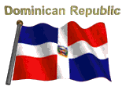
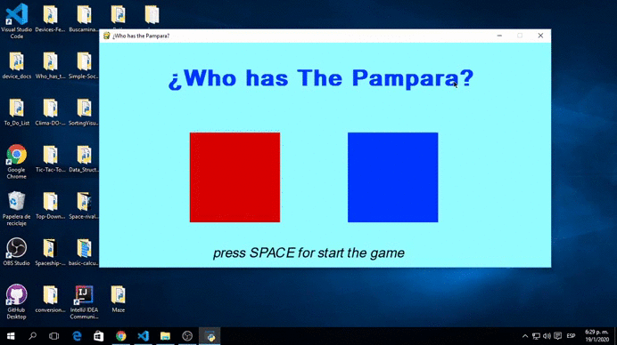

# ¿Who has the Pampara?

¿Who has the Pampara? traducido a Español significa ¿Quién tiene la "Pampara"? es el titulo de este juego el cual esta enfocado en un juego multiplayer donde 2 jugadores compiten por tener una la "Pampara" la cual es una flecha que lo apunta desde arriba, hay un tiempo de 30 segundos y una vez se termina dicho lapso de tiempo gana el jugador que tenga la "Pampara" el cúal es luego mostrado en la pantalla de fin de juego con el titulo del ganador.

## ¿Qué significa "Pampara"?

La "Pampara" es un termino utilizado en República Dominicana donde la persona que utiliza esta palabra quiere decir que está bien o que es el que está ganando en algo.

El termino fue popularizado en el año 2019 por Kiko el Crazy el cual es un artista urbano de la República Dominicana en cual tomo auge y protagonismo en ese mismo año, este termino fue poco aceptado por la sociedad en un comienzo pero luego se fue conviertiendo en un termino utilizado tanto en clase media como en la clase baja de República Dominicana.

## Controles de juegos 

Player 1(RED) -> a(left) - d(right) - w(up) - s(down)

Player 2(RED) -> LEFT - RIGHT - UP - DOWN
